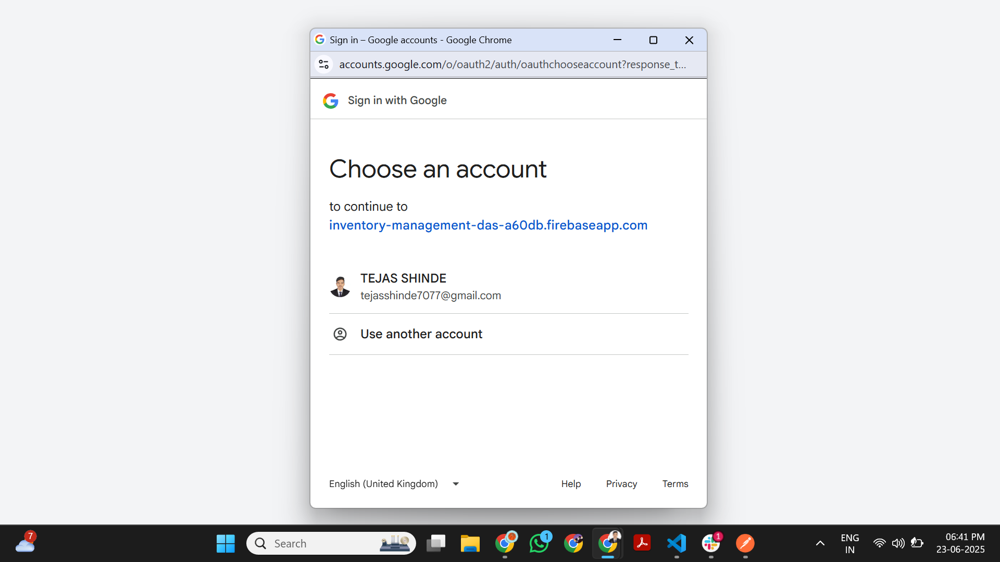

# inventory management dashboard frontend 

this is frontent of inventory management dashboard

## what i implemented 
1. user logins
     - google login ( via firebase )
     - email and pass based login
3. product dashboard for CURD operations
4. visually appealing UI
5. protected dashboard
6. API integration with backend

## tech stack 
  - react + vite
  - tailwind css
  - firebase authencation

## setup instructions 
  1. clone repo
  2. install dependencies
  3. firebase configuration
      create firebase.js in /src folder
      import { initializeApp } from "firebase/app";
      import { getAuth, GoogleAuthProvider } from "firebase/auth";

      const firebaseConfig = {
        apiKey: "your_api_key",
        authDomain: "your_project_id.firebaseapp.com",
        projectId: "your_project_id",
        storageBucket: "your_project_id.appspot.com",
        messagingSenderId: "your_sender_id",
        appId: "your_app_id"
      };

      const app = initializeApp(firebaseConfig);
      export const auth = getAuth(app);
      export const provider = new GoogleAuthProvider();```


  4. run frontend
       - pnpm run dev
    


  ### routes 

    / - login page 
    /dashboard - to view all dashboard


  ### view deployment 

      vercel - https://inventory-management-dashboard-frontend-sr17-4s3eul0tk.vercel.app/


### view screenshots 

      
     1. Login
          

     2. Login ( Loading ) 
          
     
     3. Login ( sign in with google ) 
          

     4. Login ( choose an account ) 
          

     5. Main Dashboard
          

     6. Add Product 
          

     7. Edit Product 
          

     8. Confirm Delete 
          

     9. product schema 
          


      


       
